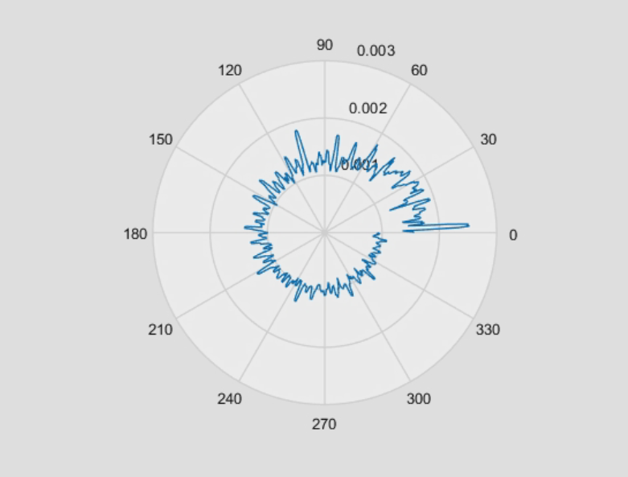
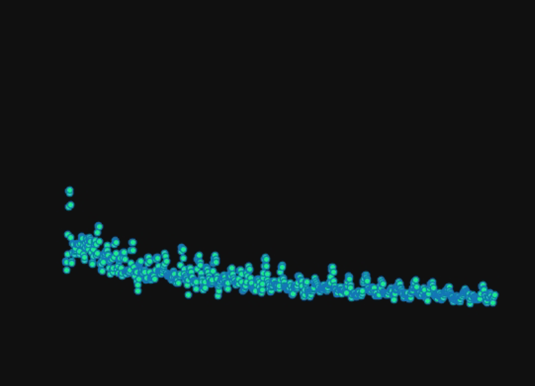
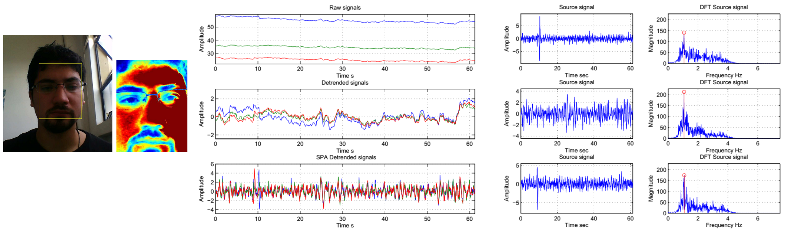
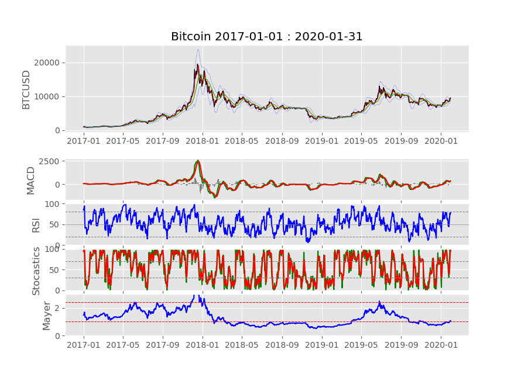
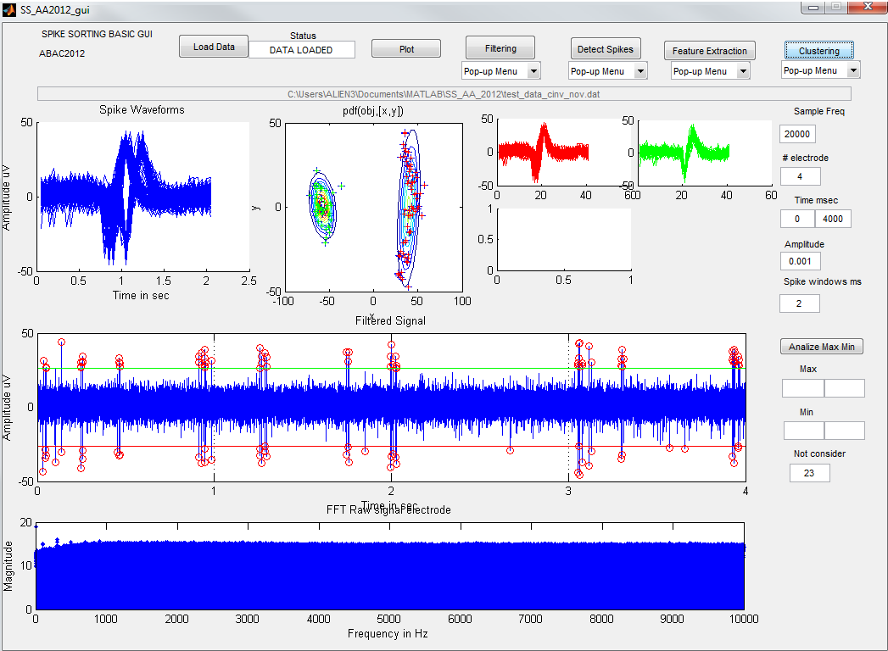

# Aland's Portfolio
This is my github porfolio. It contains a few of my favourite projects.

This main page contains the main projects.

# [Project 1. Fun Data Plot](https://github.com/) 
* Tool to show data in different ways.
* Features:
  * Support matrices
  * Support characters 
  * Support several data formats

* Built using Python

[//]:  

# [Project 2. Music Visualisation](https://github.com/) 
For this example project I built a music visualisation. 

I was able to get a chunk of samples from a spectrum estimator using the audio file as input and then I transformed this in visualisation according to the sampling rate. 

* Features:
  * Support for mp3 files
  * It allows 3 different plotting methods

* Built in MATLAB

[//]:  

# [Project 3. Video Analysis to obtain heart pulse signal ](https://github.com/) 
This example shows how to use Independent Component Analysis (ICA) on a video analysis to obtain pulse signal and other measures. 

* Features:
  * Support for mpeg files
  * Fast ICA method (reference here)

* Built in MATLAB

# [Project 4. Cryptocurrency mapping - Time-series modelling ](https://github.com/) 
This tool analyses and models cryptocurrencies time-series dynamics in order to understand potential interactions in time. 

* Features:
  * Support one or multiple cryptocurrencies
  * Several options available in order to map values or ranges

* Built in Python - Tensorflow

* Pending:
  * Add sentiment time series and analysis

# [Project 5. Spike sorting GUI for in-vitro retina neural signals ](https://github.com/) 
This GUI tool allows to perform a demo of the spike sorting algorithm (based on Principal Component Analysis, PCA) on in-vitro retina neural data. 

* Features:
  * Support neural data from different sources
  * Allows to select the number of potential neurons to seek

* Built in MATLAB

# Additional Info
This porfolio was developed based on an example porfolio you can find here:
* "How to Make A Data Science Portfolio Website with Github Pages" (Ken Jee)
* https://www.youtube.com/watch?v=1aXk2RViq3c
* https://github.com/PlayingNumbers/Ken_Portfolio
